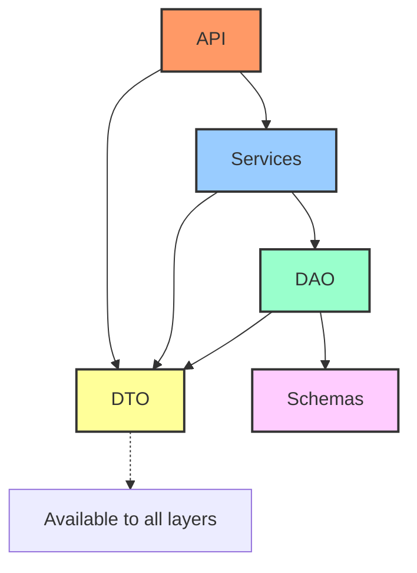

# FastAPI Naive

Fast API application template with a clean layered architecture.

## Architecture

The application follows a clean layered architecture pattern:

### Layer Description

- **API Layer**: Обрабатывает HTTP-запросы и ответы
- **Services Layer**: Содержит бизнес-логику приложения
- **DAO (Data Access Object) Layer**: Управляет операциями с базой данных
- **Schemas Layer**: Определяет модели SQLAlchemy для базы данных
- **DTO Layer**: Определяет модели Pydantic для передачи данных между слоями

## Setup Instructions

### Docker Setup
- Always rename networks in `networks` section to `project_net`
- Use only `project_net` for all networks in the file

### Environment Setup
- Create virtual environment with `python -m venv .venv`
- After creating the environment, run `uv init`
- Edit your `pyproject.toml` with necessary dependencies
- Run `uv sync` to install dependencies
