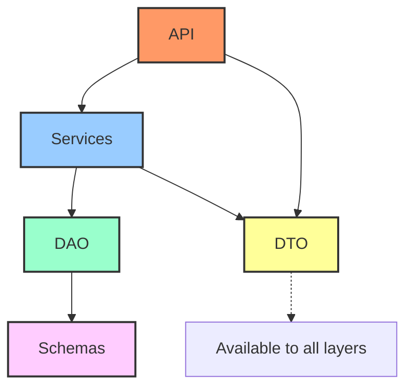

# Архитектурные Слои Приложения

Приложение следует паттерну чистой слоистой архитектуры для четкого разделения ответственностей и улучшения поддерживаемости кода.

## Диаграмма Архитектуры

## Описание Слоев

-   **API Layer (Слой API)**:
    -   Отвечает за обработку входящих HTTP-запросов и формирование HTTP-ответов.
    -   Преобразует HTTP-запросы в вызовы сервисного слоя, используя DTO для передачи данных.
    -   Валидирует входящие данные (часто с помощью FastAPI и Pydantic DTO).
    -   Расположение: `src/app/api/`
    -   Примечание: Сессии базы данных не передаются в обработчики роутов через `Depends(get_session)` (или аналогичный механизм). Управление сессиями и транзакциями инкапсулировано в сервисном слое с использованием паттерна Unit of Work (UoW).

-   **Services Layer (Сервисный Слой)**:
    -   Содержит основную бизнес-логику приложения.
    -   Координирует взаимодействие между различными DAO и другими сервисами.
    -   Не зависит от деталей HTTP, а работает с DTO и бизнес-объектами.
    -   Использует DAO для доступа к данным.
    -   Расположение: `src/app/services/`

-   **DAO (Data Access Object) Layer (Слой Доступа к Данным)**:
    -   Инкапсулирует логику взаимодействия с базой данных.
    -   Предоставляет CRUD (Create, Read, Update, Delete) и другие операции для конкретных сущностей (SQLAlchemy Schemas).
    -   Работает с объектами SQLAlchemy (Schemas) и преобразует их в DTO (или наоборот) для сервисного слоя.
    -   Расположение: `src/app/dao/`

-   **Schemas Layer (Слой Схем)**:
    -   Определяет структуру таблиц базы данных с использованием моделей SQLAlchemy.
    -   Каждая модель представляет таблицу в БД и ее поля.
    -   Расположение: `src/app/schemas/`

-   **DTO (Data Transfer Objects) Layer (Слой Объектов Передачи Данных)**:
    -   Определяет модели Pydantic, используемые для передачи структурированных данных между слоями (особенно между API, Services и DAO).
    -   Обеспечивают валидацию данных, сериализацию и десериализацию.
    -   Помогают отделить формат данных, используемый в API, от внутреннего представления данных в БД.
    -   Расположение: `src/app/dto/`
